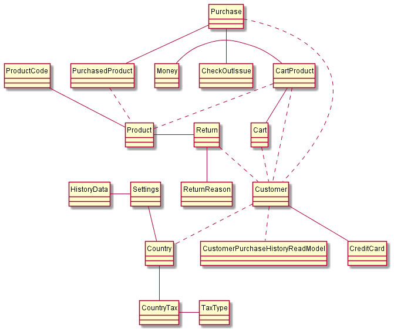
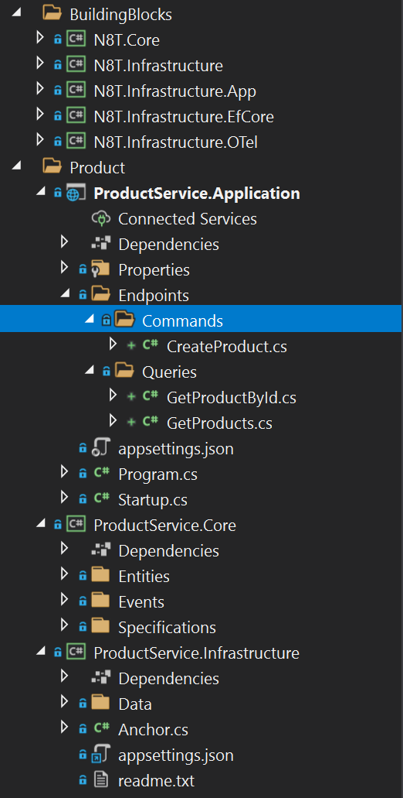

# practical-clean-ddd

The practical repository uses coolstore domain which is mainly borrowed from `https://github.com/zkavtaskin/Domain-Driven-Design-Example` to demonstrate how to apply Domain Driven Design seamlessly with Clean Architecture.

## Give a star ⭐

A bright future of the .NET Community! What you LIKE or SHARE on `practical-clean-ddd` repository will help to strengthen and spread-out the way YOU develop the cloud-native application with the .NET platform and toolings as well as microservices development on Dapr and Kubernetes with .NET toolkit.

So if you use this repository for your samples, workshop, your project or whatever you did, please give a star ⭐ for it. Thank you very much :+1:

# Give it a try!

- Prerequisite
  - .NET SDK: 5.0.200-preview.21079.7
  - Rust: v1.50.0
  - nodejs: v15.5.1
  - tye: 0.7.0-alpha.21070.7+eb3b50699b7a5f2d0997a5cc8c5185d056dde8ec
  - dapr: 1.0.0

- Starting the Api

```
$ tye run
```

- Starting the web application

```
$ cd src\Web
$ npm i
$ npm run dev
```

- Public Apis:

> Tye Dashboard: [http://localhost:8000](http://localhost:8000)

<table>
  <thead>
    <th>No.</th>
    <th>Service name</th>
    <th>Service uri</th>
  </thead>
  <tbody>
    <tr>
      <td>1</td>
      <td>gateway</td>
      <td><a href="http://localhost:5000">http://localhost:5000</a></td>
    </tr>
    <tr>
      <td>2</td>
      <td>product (internal)</td>
      <td><a href="http://localhost:5002">http://localhost:5002</a></td>
    </tr>
    <tr>
      <td>3</td>
      <td>customer (internal)</td>
      <td><a href="http://localhost:5003">http://localhost:5003</a></td>
    </tr>
    <tr>
      <td>4</td>
      <td>setting (internal)</td>
      <td><a href="http://localhost:5005">http://localhost:5005</a></td>
    </tr>
    <tr>
      <td>5</td>
      <td>audit (internal)</td>
      <td><a href="http://localhost:5010">http://localhost:5010</a></td>
    </tr>
    <tr>
      <td>6</td>
      <td>frontend</td>
      <td><a href="http://localhost:3000">http://localhost:3000</a></td>
    </tr>
  </tbody>
</table>

# Business Usecases


# High level context



# ERD


# Clean Domain Driven-design

Domain-driven Design demonstrates it can help the business tidy and organized in many years. But it is hard to approach and use, we need to make it easier to use in the real project when we get started. 

Clean Architecture helps the project structure easier to refactor and evolve in medium and big projects. Especially in the Microservice world, we always want to do and try with a lot of time in the project lifetime.

Clean Domain-driven Design is a collection of basic building blocks and project structure to help we get starting the project with less code boilerplate and effortless. We focus on the Microservice approach of how can we organize code, the project with the monorepo approach, and you can use it for modular monolith project as well.



## Core project
### Domain

TODO

### Repository

TODO

## Infrastructure project

TODO

## Application project

TODO

# Public CRUD interface

In medium and large software projects, we normally implement the CRUD actions over and over again. And it might take around 40-50% codebase just to do CRUD in the projects. The question is can we make standardized CRUD APIs, then we can use them in potential projects in the future? That is in my mind for a long time when I started and finished many projects, and I decide to take time to research and define the public interfaces for it as below

## Common

```csharp
public record ResultModel<T>(T Data, bool IsError = false, string? ErrorMessage = default);
```

```csharp
public interface ICommand<T> : IRequest<ResultModel<T>> {}
```

```csharp
public interface IQuery<T> : IRequest<ResultModel<T>> {}
```

## [R]etrieve

```csharp
// input model for list query (normally using for the table UI control with paging, filtering and sorting)
public interface IListQuery<TResponse> : IQuery<TResponse>
{
  public List<string> Includes { get; init; }
  public List<FilterModel> Filters { get; init; }
  public List<string> Sorts { get; init; }
  public int Page { get; init; }
  public int PageSize { get; init; }
}
```

```csharp
// output model with items, total items, page and page size with serving for binding with the table UI control
public record ListResponseModel<T>(List<T> Items, long TotalItems, int Page, int PageSize);
```

```csharp
public interface IItemQuery<TId, TResponse> : IQuery<TResponse>
{
  public List<string> Includes { get; init; }
  public TId Id { get; init; }
}
```

## [C]reate

```csharp
public interface ICreateCommand<TRequest, TResponse> : ICommand<TResponse>, ITxRequest
{
    public TRequest Model { get; init; }
}
```

## [U]pdate

```csharp
public interface IUpdateCommand<TRequest, TResponse> : ICommand<TResponse>, ITxRequest
{
  public TRequest Model { get; init; }
}
```

## [D]elete

```csharp
public interface IDeleteCommand<TId, TResponse> : ICommand<TResponse> where TId : struct
{
  public TId Id { get; init; }
}
```

# Sample pages


# Refs
- [Ant Design Components](https://ant.design/components/overview)
- [C4 PlaintUML Model](https://github.com/plantuml-stdlib/C4-PlantUML/blob/master/samples/C4CoreDiagrams.md)
- [Real world PlantUML](https://real-world-plantuml.com)